# Que dicen las redes de los candidatos?

En este Hands-on vamos a estar usando las capacidades de Watson para analizar **6.000** tweets del mes de Julio donde se haya mencionado a **Daniel Martinez**, **Luis Lacalle Pou** o **Ernesto Talvi**, tres de los candidatos presidenciales para las Elecciones de Octubre de Uruguay.

### Introduccion:

Que haremos?
Procesamiento de Lenguaje Natural.
Clasificacion de texto.

Usaremos tres servicios:
Watson.
 - Natural Language Classifier:
    IBM Watson™ Natural Language Classifier puede ayudar a su aplicación a entender el lenguaje de textos cortos y a hacer predicciones sobre cómo manejarlos. Un clasificador aprende de sus datos de ejemplo y puede devolver información sobre textos sobre los que no está entrenado. Puede crear y entrenar este clasificador en menos de 15 minutos.

    Una vez creado el servicio, en panel izquierdo ingresamos a Credenciales de servicio y copiamos las credenciales.
    ```
    {
      "apikey": "BVXhIyHoEtdUSjNPpZSWcXEvg6jjMNnieYVY3DeL8Z80",
      "iam_apikey_description": "Auto-generated for key c8f8fc59-d722-468b-89f5-2cf29746fbd1",
      "iam_apikey_name": "Auto-generated service credentials",
      "iam_role_crn": "crn:v1:bluemix:public:iam::::serviceRole:Manager",
      "iam_serviceid_crn": "crn:v1:bluemix:public:iam-identity::a/6e78166e125a4400b022b3b2fda9b4e0::serviceid:ServiceId-7d67296d-d456-4618-93c0-e45bee6b4948",
      "url": "https://gateway.watsonplatform.net/natural-language-classifier/api"
    }
    ```
    Luego, en el panel izquierdo, ingresamos a Manage y le damos click a Iniciar Watson Studio
 - Watson Assistant

 - Natural Language Understanding

### Pre-Requisitos:
Antes de comenzar con el Hands-On asegurate de cumplir con todos los requisitos:
1. [Node.JS v10.9.0 or higher](https://nodejs.org/en/)
2. [Cuenta en IBM Cloud](https://ibm.biz/Bd26aa)
3. Un IDE / Editor de texto. [Visual Studio Code](https://code.visualstudio.com/download)


Para verificar que tengamos node.js instalado,ingresamos a la terminal y ejecutamos el siguiente comando:
```
node -v
```
Esto nos debería retornar un mensaje con la version de node, por ejemplo:
```
v10.16.0
```
#### Ademas se van a usar las siguientes tecnologías:
* Watson Assistant*
* Watson Natural Language Understanding
* Watson Natural Language Classifier
* Twitter API
* Node-RED
* Cloudant
---
**Si los tres pre-requisitos fueron satisfechos, podremos comenzar con el hands-on**

### Etapas:
#### 1. [Clonar el Proyecto]()

Si tenemos git instalado: abriremos una terminal, nos movemos a un directorio deseado y ejecutamos:
```bash
git clone
```
En caso de no tener git instalado, descargaremos esta carpeta como un ZIP y la descomprimos en un directorio deseado.

Estando en la terminal nos movemos hacia el directorio donde tenemos nuestro proyecto y ejecutamos
```bash
  npm install
```

#### 2. [Obtener Los Tweets]()
Para obtener los Tweets se usa la [API de Twitter](https://developers.twitter.com).
En este hands-on no haremos la extraccion de Tweets ya que para tener acceso a la API se precisa una autorizacion por parte de Twitter que demora unas horas.
De todas maneras, al final de este paso-a-paso queda un [Anexo](#6.-anexo:-extraccion-de-tweets-usando-la-api-de-twitter) donde se explica como realizar una extraccion de tweets.

#### 3. [Generar conjunto de entrenamiento y testeo]()
Luego de haber hecho la extraccion de tweets y obtener nuestro set de datos, precisamos obtener un conjunto de estos para entrenar y luego otro para el testeo. En un problema clasico de Machine Learning, usariamos el 80% de nuestros Tweets para el entrenamiento y luego el 20% para realizar las pruebas.

La gran ventaja de usar Watson es que no precisamos un conjunto tan grande de entrenamiento. Por supuesto, cuanto mas ejemplos tengamos para el entrenamiento mejor van a ser los resultados (aunque esta tarea hay que realizarla con cuidado, a veces a Watson lo entrenamos quitandole ejemplos).

Notaremos que en nuestro proyecto tenemos una carpeta `trainTweets` y otra `testTweets`. Dentro de cada una de estas, tenemos un archivo `.csv` para cada candidato.

#### 4. [Entrenamiento de Watson Assistant]()

El primer servicio de Watson que usaremos para la clasificación de Tweets será Watson Assistant.

- **4.1. Crear servicio de Watson Assistant**

  - **4.1.1** Una vez que hayas iniciado sesion en [IBM Cloud](https://cloud.ibm.com) en el panel superior le darás click a [Catálogo](https://cloud.ibm.com/catalog).

    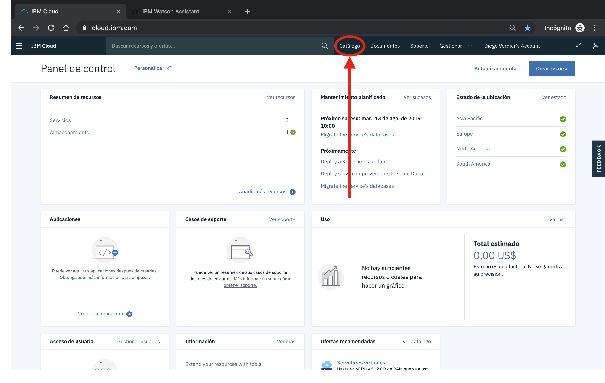

  - **4.1.2** En esta seccion de IBM Cloud vas a poder encontrar todos los servicios disponibles filtrando por categoria o nombre.
    El servicio de Watson Assistant lo encontramos en la seccion de [AI](https://cloud.ibm.com/catalog?category=ai)

    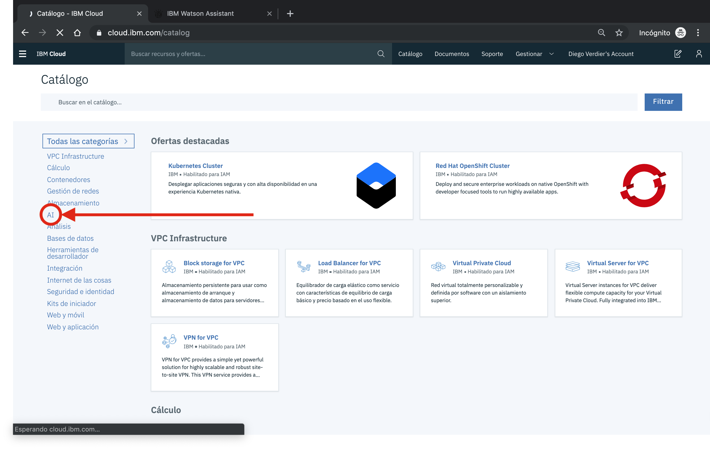

  - **4.1.3** En esta seccion vamos a encontrar todos los servicios que hay de Watson disponibles en la nube y otros que usan Inteligencia Artificial.

    

  - **4.1.4** Una vez que seleccionamos el servicio de Watson Assistant, tenemos que definir:
    - Un nombre (p.ej: Watson Assistant-CodeDay-Candidatos)
    - La region donde vamos a querer alojar nuestra instancia de Watson Assistant (en este hands-on usaremos la region de Dallas)
    - El plan que precisamos para nuestro servicio. En este caso Seleccionamos el Lite/Free/Gratis.

  - **4.1.5** Creamos el servicio.

    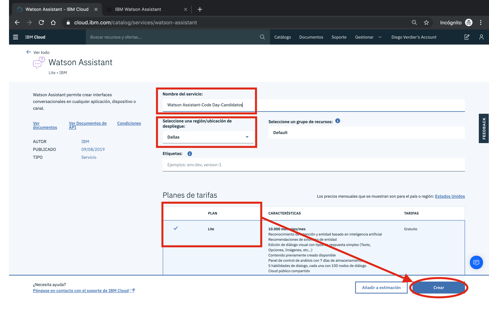

  - **4.1.6** Esperamos a que se cree nuestro nuevo servicio de Watson Assistant, y una vez que esto finalice, copiaremos la Clave de API (API KEY) y la URL y la guardaremos en un lugar para tenerlo a mano:

    

  - **4.1.7** Iniciamos el servicio de Watson Assistant.

    

  - **4.1.8** Una vez que se haya iniciado el servicio estaremos frente My First Assistant (Mi primer Asistente). Como este servicio se usa para desarrollar chatbots principalmente y este no va a ser nuestro caso, la parte de assistants no la precisaremos.
    En el panel superior en la esquina izquierda, ingresaremos a la parte de _Skills_.

    

  - **4.1.9** Creamos una nueva skill.

    _Una skill es una habilidad. Es la habilidad que le vamos a desarrollar y enseñar a Watson. En nuestro caso sera enseñarle los distintos significados que puede llegar a tener un tweet sobre candidatos_

    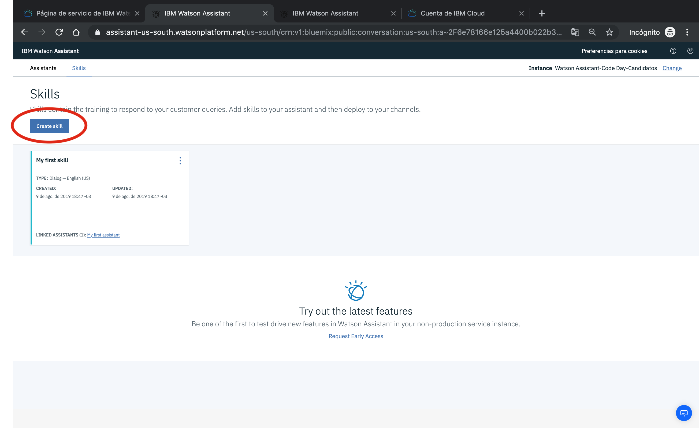

  - **4.1.10** Seleccionamos la opcion Dialog Skill

    

  - **4.1.11** A nuestra nueva Skill le asignaremos:
    - Un nombre (p.ej: Tweets Candidatos)
    - Un lenguaje (ESPAÑOL). **IMPORTANTE NO OLVIDAR CAMBIAR EL IDIOMA CON EL QUE VAMOS A ENTRENAR A WATSON**

    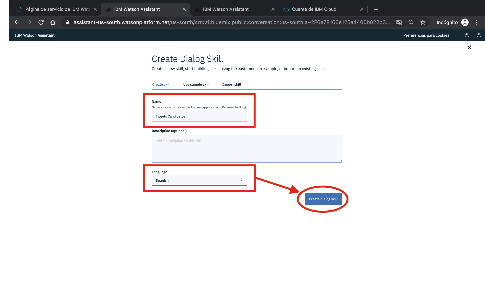

    Una vez que hayamos creado correctamente nuestra nueva skill, deberiamos estar viendo una pantalla similar a esta:

    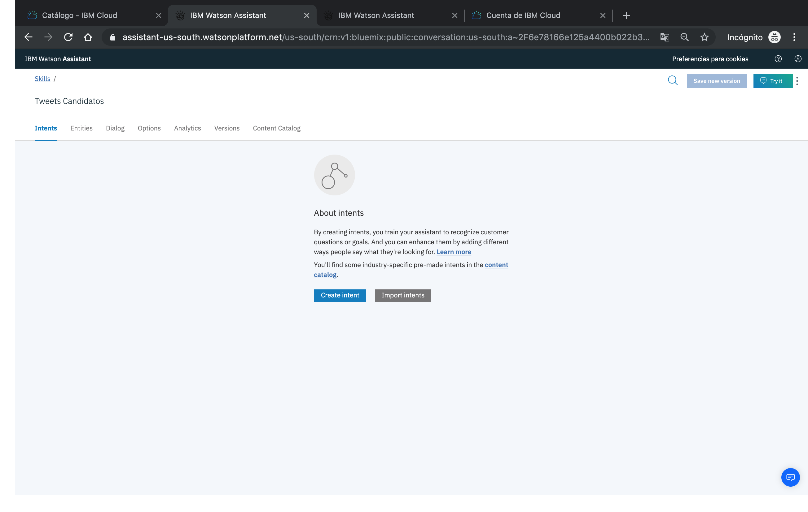

  - **4.1.12** Creamos dos intenciones:
    - Apoyo_T: _Tweets que demuestran un apoyo o afecto hacia Ernesto Talvi o al Partido Colorado_

      Los pasos para crear esta intencion son los siguientes:

      * Selecionamos Create Intent:

        Vamos a ingresar de nombre **Apoyo_T** (Importante que respeten el nombre para cuando importemos mas intenciones) y creamos la intencion

        

      * Luego agregamos los siguientes ejemplos en donde dice _Add user example_
      ```
        El partido colorado va a estar en el balotage
        Ernesto futuro presidente. Vamos!
        Robert silva va a ser el vice presidente del pais
        Talvi tiene el mejor programa de gobierno
        Talvi va a ganar
      ```
      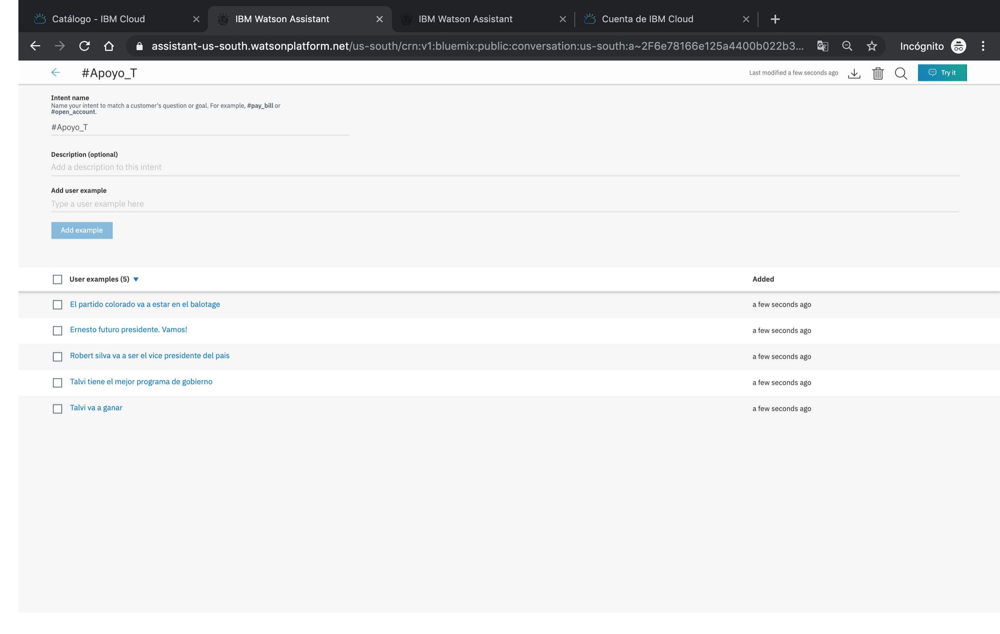

      * Al finalizar iremos hacia el menu anterior para crear la intencion Critica_T

    - Critica_T: _Tweets que muestran un rechazo o un desacuerdo con Ernesto Talvi o con el Partido Colorado_

      El proceso es analogo al anterior, con los siguientes ejemplos de entrenamiento:
      ```
        El partido colorado no tuvo ningun crecimiento
        Muy mal Talvi dejando afuera a Bordaberry
        Robert Silva deberia estar inahbilitado
        Talvi es un creido y le va a ir mal
        Talvi no llega al balotage ni de casualidad
      ```

  - **4.1.13** Testeamos a Watson:

    Una vez terminado esto deberíamos tener algo así:

    

    Una vez que clickeamos en `Try Out` se nos abrirá un chat en la parte derecha. Como este servicio está pensado para el desarrollo de chatbots, la parte de testeo es un chat. Una vez abierto esto veremos que en la parte superior hay un cartel avisando que Watson está entrenando.

    

    Cuando seamos notificados de que Watson está listo para ser probado, ingresaremos tweets al panel de testeo.

    

    ```
      Talvi es un enano malagradecido. Física y mentalmente.
      Tengo claro que el grupo de votantes del Cr. Astori pasara a votar a Talvi.
      Muy soberbio Talvi esta tarde en el 10 con Folle. Criticó a Manini porque habló de la seguridad de mediados de los 80. Los militares se fueron el 1 de marzo del 85 por tanto la mitad de los 80 no es desde 1980 al 84 que fueron las elecciones. Juega para la hinchada.
      No hay duda que Talvi gana el ballotage
      Con todo respeto no comparto lo suyo . Sanguinetti un traidor siempre y Talvi un déspota.
    ```
    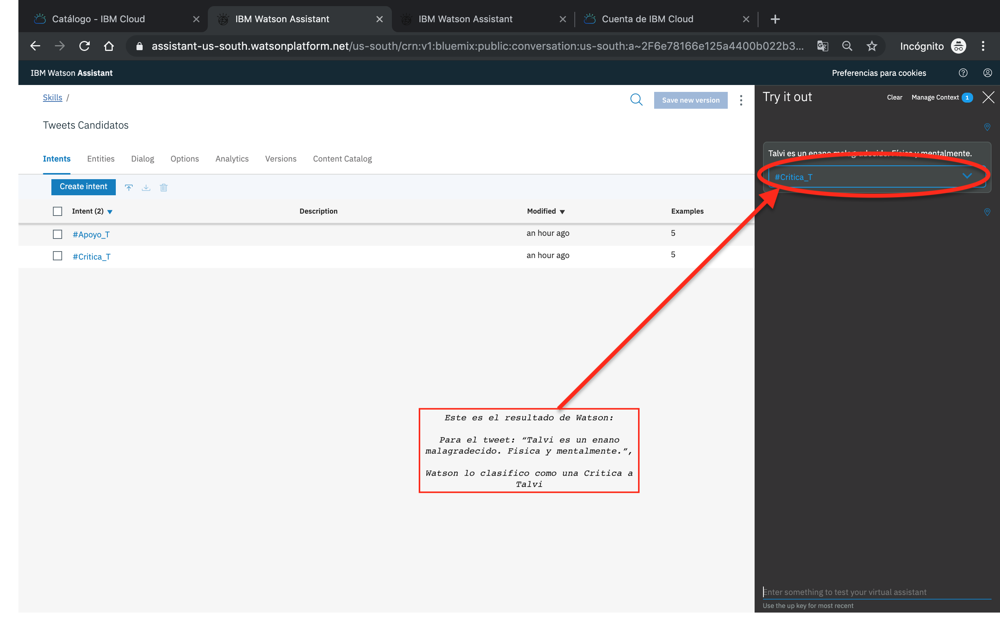

    Podemos notar que estos ejemplos son bastante diferentes con los que entrenamos.

    Funciona bastante bien, no?

  - **4.1.14** Ahora cargaremos mas intenciones, previamente definidas.

    En nuestro menu principal, le daremos click al icono para importar intenciones.

    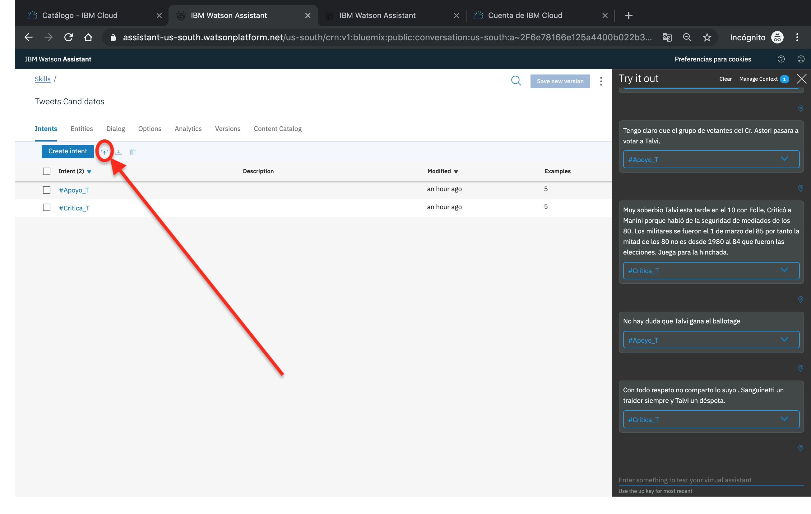

    Las intenciones se pueden cargar mediante un archivo `.csv` con el siguiente formato:
    ```
      ejemplo1,intencionA
      ejemplo2,intencionA
      ejemplo3,intencionB
      ejemplo4,intencionC
      ...
    ```
    Una vez que se nos abra el pop-up para cargar un nuevo archivo seleccionaremos el archivo `intentsCandidatosCodeDay.csv` que se encuentra en la carpeta `trainWatson` de este proyecto.

    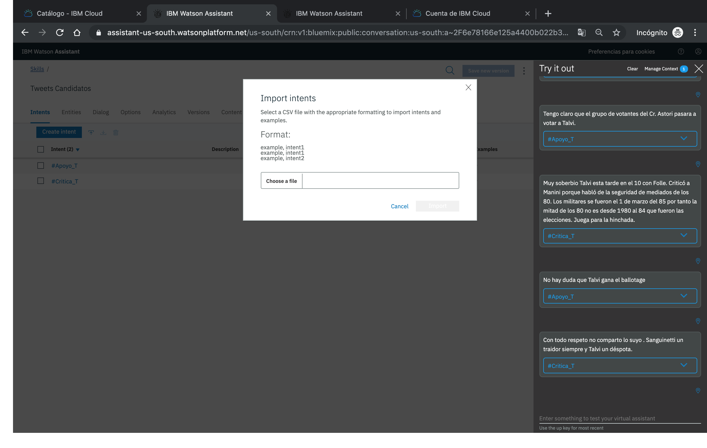

    Se agregarán 13 nuevas intenciones:

    Luego de haber hecho un relevamiento general de todos los tweets que extraje del mes de julio, defini las siguientes categorias:
    > 1. Apoyo_DM: Tweets que muestran un apoyo a Daniel Martinez y/o al Frente Amplio
    > 2. Apoyo_LP: Tweets que muestran un apoyo a Luis Lacalle Pou y/o al Partido Nacional
    > 3. Apoyo_T: Tweets que muestran un apoyo a Ernesto Talvio y/o al Partido Colorado
    > 4. Critica_DM: Tweets que muestran un rechazo a Daniel Martinez y/o al Frente Amplio
    > 6. Critica_LP: Tweets que muestran un rechazo a Luis Lacalle Pou y/o al Partido Nacional
    > 6. Critica_T: Tweets que muestran un rechazo a Ernesto Talvio y/o al Partido Colorado

    En los tweets que tenían que ver con Daniel Martinez se leia con frecuencia criticas a su gestion como intendente y criticas por la designacion de su Vicepresidente, por eso se crearon las intenciones
    > 7. Critica_DM_Intendencia
    > 8. Critica_DM_Formula
    > 9. Apoyo_DM_Formula

    En los tweets hacia Lacalle Pou los que mostraban un apoyo eran muy variados, no hubo un tema que marcara mas tendencia que el resto. Pero en los tweets negativos hacia él habian dos categorias bien definidas:
    > 10. Critica_LP_Trabajo: Haciendo alusion a que nunca trabajó en otro lugar que no fuese el Parlamento
    > 11. Critica_LP_Renuncia: Tweets haciendo referencia a que no ha presentado renuncia al Parlamento a pesar de hacer Campaña.

    En el caso de Talvi, la decision de la formula fue un tema que dió que hablar, el no incluir a Pedro Bordaberry fue otro.
    > 12. Apoyo_T_Formula
    > 13. Critica_T_Bordaberry

    Luego de importar todas las intenciones deberiamos ver algo similar a esto:

    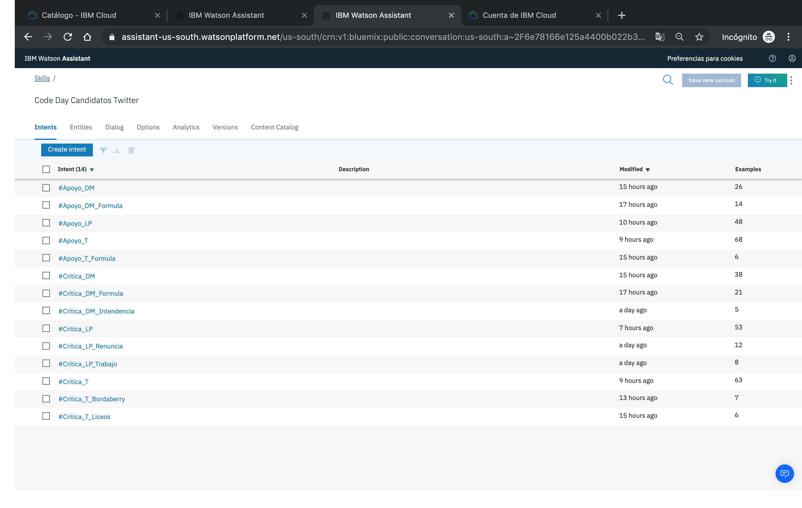

    Esperamos a que entrene y empezaremos a probar!

  - **4.1.15** Pruebas.

      Para probar podemos ingresar ejemplos mediante el panel de `Try Out` o usando la Api de Watson Assistant.

      En el proyecto que clonamos veremos que tenemos un archivo `.envEXAMPLE` que tiene lo siguiente:
      ```
        VERSION = 2019-02-28
        IAM_APIKEY =
        URL_ASSISTANT =
        ASSISTANT_ID =
      ```
      Lo primero que tenemos que hacer es renombrar este archivo a `.env`. Luego con las credenciales que copiamos en el paso [4.1.16](#4.-Entrenamiento-de-Watson)

      Para el obtener el ASSISTANT_ID lo que hay que hacer es lo siguiente:

      > 1. En el panel superior seleccionar `Skills`
      > 2. En la esquina superior izquierda seleccionar `Assistants`
      > 3. Seleccionar My First Assistant
      > 4. En la parte de Dialog seleccionar los tres puntos que aparecen en la esquina superior derecha del cuadro `My First Skill``
      > 6. En ese menu desplegable seleccionar Swap Skill
      > 6. Seleccionar el nombre de nuestra Skill, en este caso `Tweets Candidatos`
      > 7. A la derecha de `My First Assistant` aparecen otros tres puntitos, seleccionarlos.
      > 8. En el menu desplegable seleccionar la opcion `Settings``
      > 9. En el panel de la izquierda seleccionar `API Details`
      > 10. Ahi habrá un campo que es `Assistant ID`, copiamos ese identificador.

      Una vez que tenemos nuestro archivo `.env` con los cuatro campos completos estaremos listos para hacer pruebas a nuestro modelo de Watson via API.

      En nuestro proyecto iremos al archivo `twitterAssistant.js`

      Este codigo lo que hace es tomar un tweet random de cada archivo referente a los candidatos en la carpeta `/testTweets` e imprimira el resultado en la consola.

      Este codigo se ejecuta con el siguiente comando:

      ```bash
        node twitterAssistant.js
      ```

#### 5. [Clasificacion de Tweets usando Watson Natural Language Understanding]()

A diferencia de Watson Assistant, IBM Cloud nos ofrece un servicio de procesamiento de lenguaje natural que nos ofrece algunos modelos predefinidos y podemos clasificar texto segun el sentimiento del mensaje. Se clasifica en Positivo, Neutro o Negativo ademas de reconocer entidades en el texto. Se podría llegar a entrenar pero no va a ser este el caso.

Lo que vamos a hacer será, consultarle por tweets y Watson lo que nos va a decir es el tono (Positivo, Neutro o Negativo) del tweet y las entidades que encontro en dicho tweet.

- **5.1** Crear un servicio de Watson Natural Language Understanding.
  En la interfaz de IBM Cloud seleccionamos el [Catalogo](https://cloud.ibm.com/catalog). Nuevamente clickeamos en AI y luego buscamos el servicio de Watson Natural Language Understanding.

  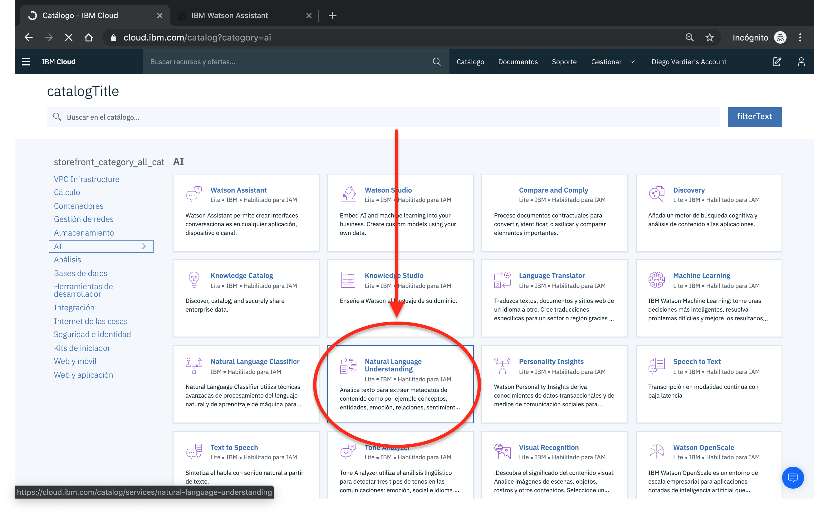

- **5.2** Al crear el servicio debemos:
    - Eleigr un nombre
    - Seleccionar la region de Dallas
    - Asegurarnos de que este seleccionado el plan Free y luego creamos el servicio.

    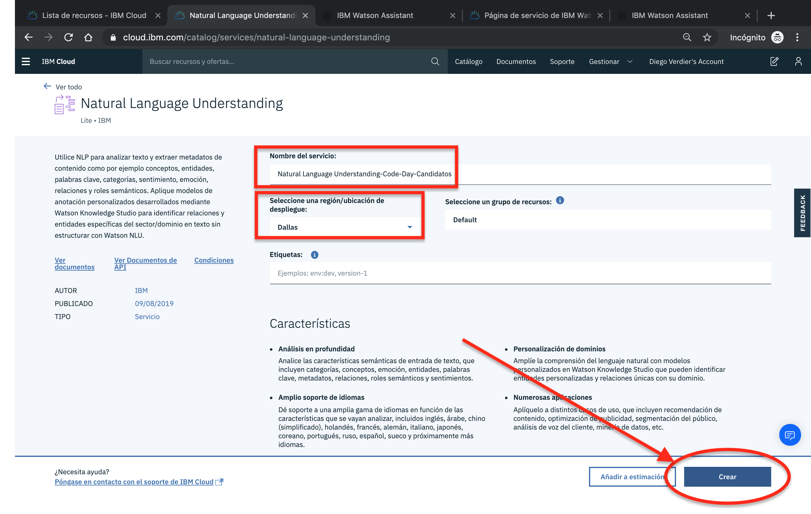

- **5.3** Una vez creado el servicio en el panel izquierdo vamos a la seccion credenciales.

  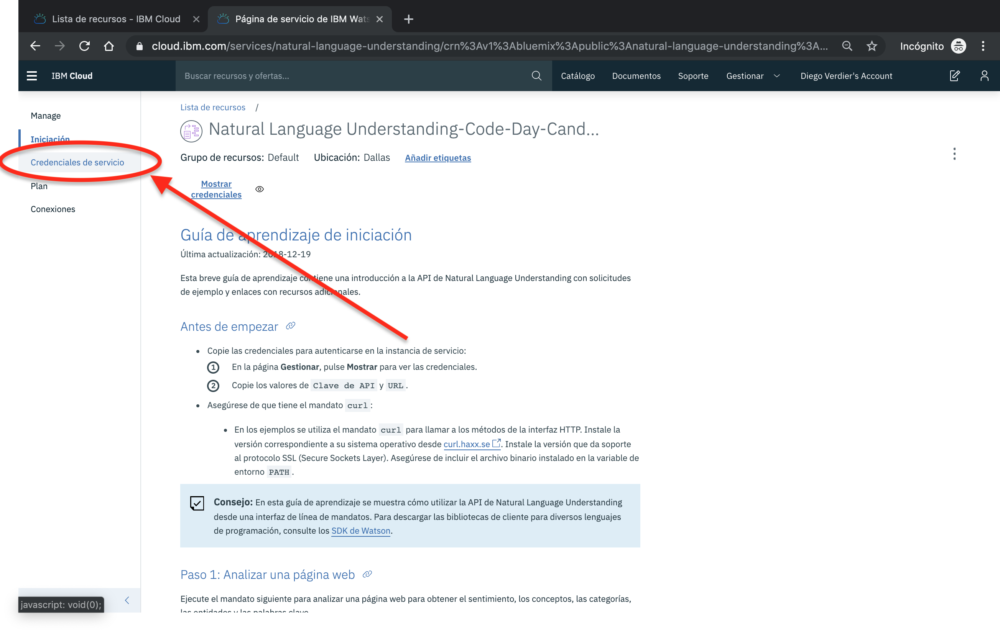

- **5.4** En la seccion Credenciales, deberiamos ver una credencial con el nombre `Auto-generated service credentials`, en caso de que sea así le dan click a `Ver Credenciales` y se copiamos unicamente lo que esta entre comillas (") en el campo `apikey`.

  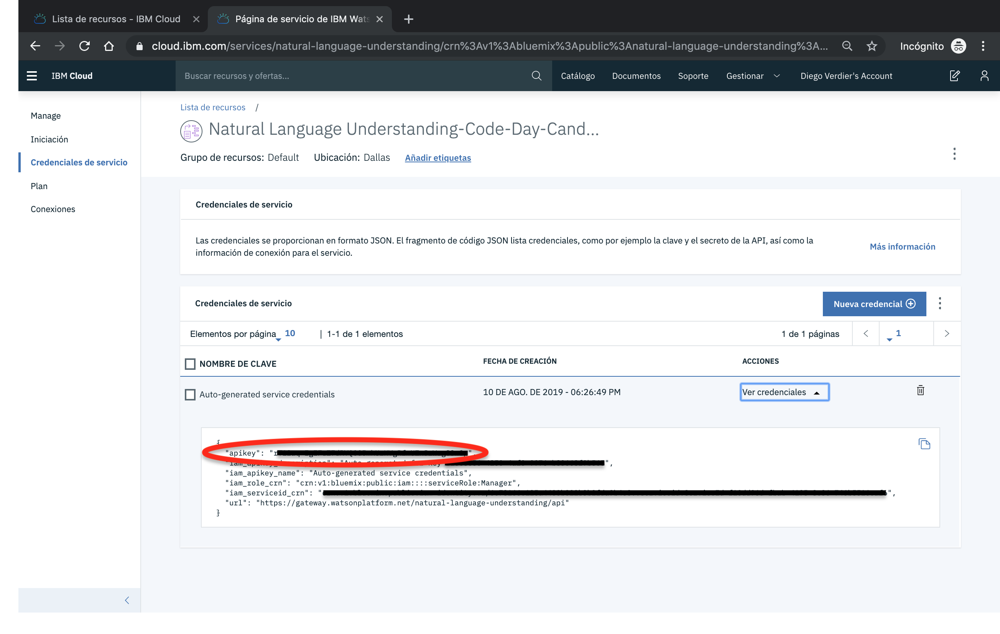

- **5.5** Copiamos esta credencial en el campo `NLU_API_KEY` del archivo `.env` que habíamos editado previamente.

  ```
    NLU_API_KEY =
  ```

- **5.6** Luego, ejecutamos el archivo twitterNLU.js. Este codigo hace algo parecido a lo que hacía `twitterAssistant.js`. Toma un tweet al azar de cada candidato y lo clasifica usando Watson Natural Language Understanding.

  ```
    node twitterNLU.js
  ```

#### 6. [Clasificación de Tweets usando Watson Natural Language Understanding y Node-RED]()

Node-RED es una herramienta de código abierto que permite construir aplicaciones simplemente uniendo elementos entre sí en un ambiente gráfico. Estos elementos pueden representar dispositivos de hardware, APIs web o servicios accesibles en internet. En IBM Cloud es muy sencillo crear un ambiente Node-RED que pueda acceder a los servicios de la plataforma.

- **6.1** Crear la aplicación Node-RED
  * **6.1.1** Entramos al [catalogo de IBM Cloud](https://cloud.ibm.com/catalog) y en el panel de la izquierda seleccionamos `Kits de Iniciador (Starter kit)`

    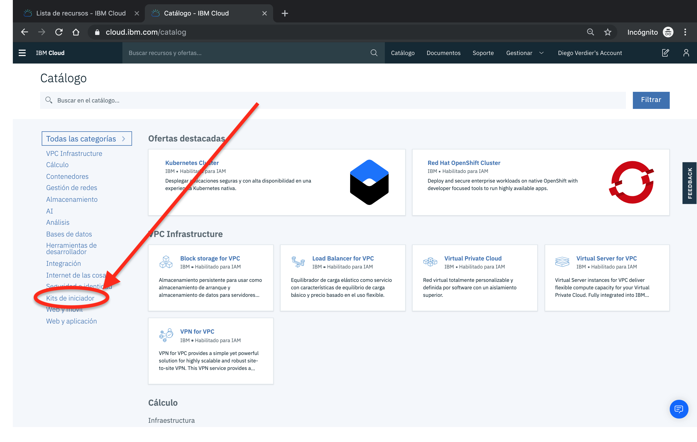

  * **6.1.2** Luego buscamos y seleccionamos el servicio Node-RED Starter.

    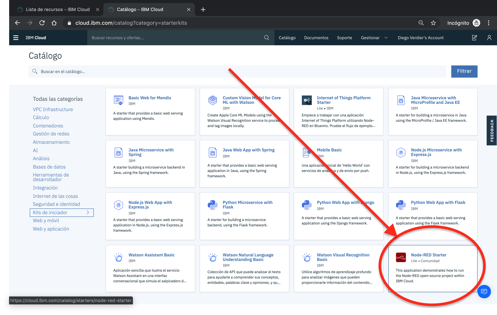

  * **6.1.3** A nuestra aplicación Node-RED debemos asignarle:

    - Un nombre unico (p.ej: node-red-code-day-candidatos-diego-verdier).

    Cabe mencionar que lo que estamos creando es una aplicacion desarrollada en node.js que usa la herramienta Node-RED y usa una base de datos CloudantDB.

    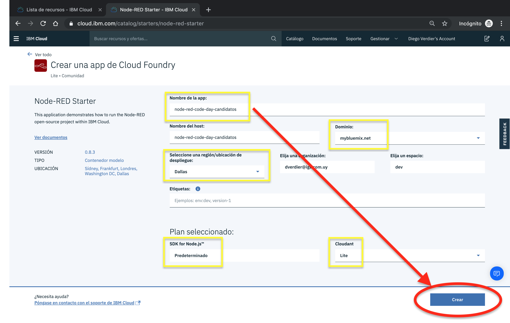

- **6.2** Una vez que hayamos creado la aplicacion, luego de unos segundos, estara disponible y se accedera mediante `Visitar URL de APP (Visit app URL)`o ingresando a https://\<nombre-que-hayan-elegido>.mybluemix.net (p.ej: https://node-red-code-day-candidatos-diego-verdier.mybluemix.net)

  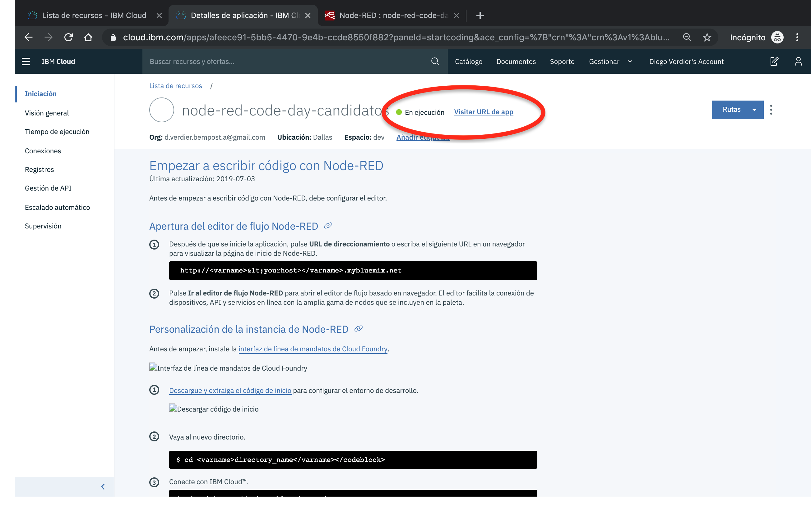

  Una vez que hayan entrado a la ruta de su aplicacion, deberían estar viendo algo como esto:

    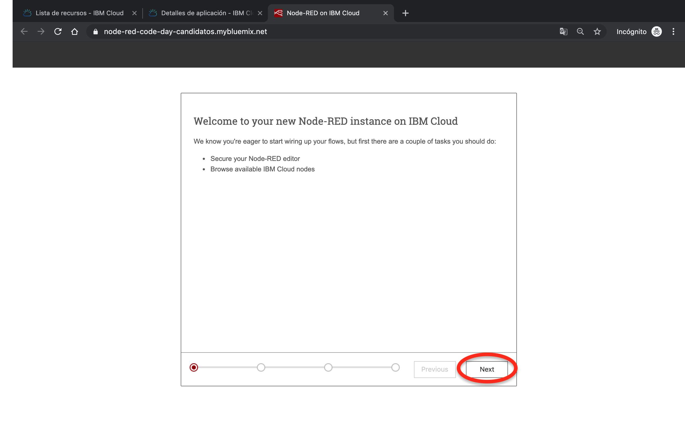

  * **6.2.1** Le damos click a `Next` y nos pedira que se registren mediante un usuario y una contraseña.

    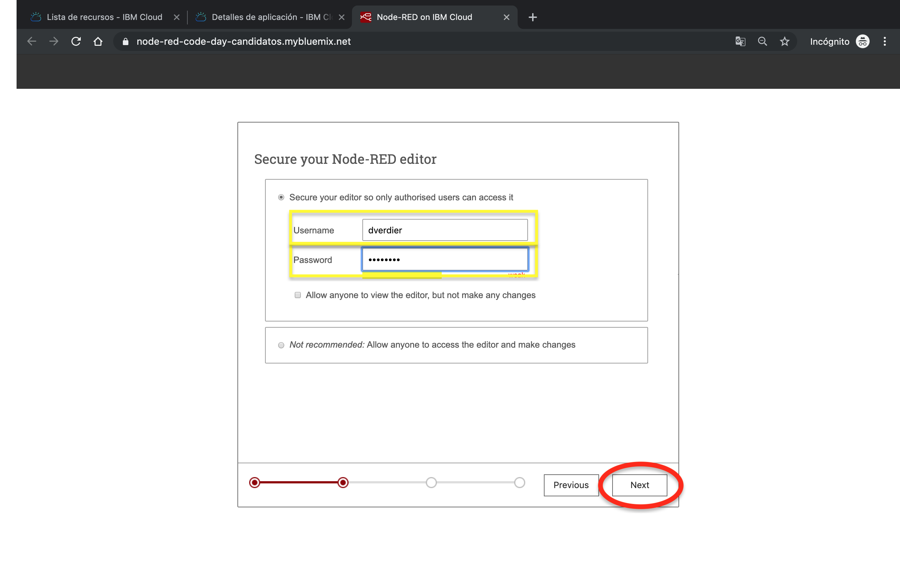

  * **6.2.2** Luego de elegir un usuario y contraseña, nuevamente le damos click a `Next` y estaremos frente a una pantalla que nos ofrece diferentes _nodos para ser utilizados en Node-RED creados por la comunidad_, no seleccionaremos ninguno y nuevamente clickeamos en `Next` y por ultimo clickeamos en `Finish`

    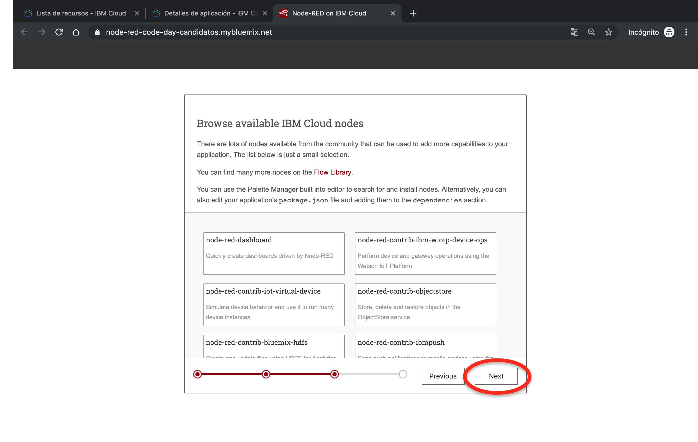

  * **6.2.3** Una vez que hayamos llegado algo como lo de abajo, clickearemos `Go to Node-Red Flow`

    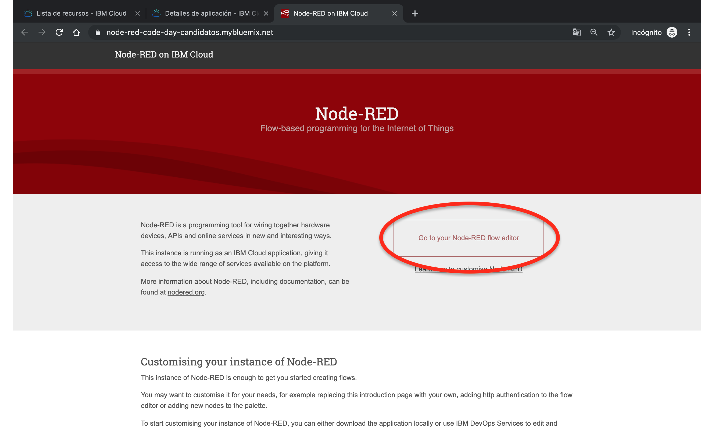

  * **6.2.4** Iniciaremos sesion con el usuario y contraseña que elegimos anteriormente y finalmente estaremos listos a empezar a trabajar con Node-RED.

    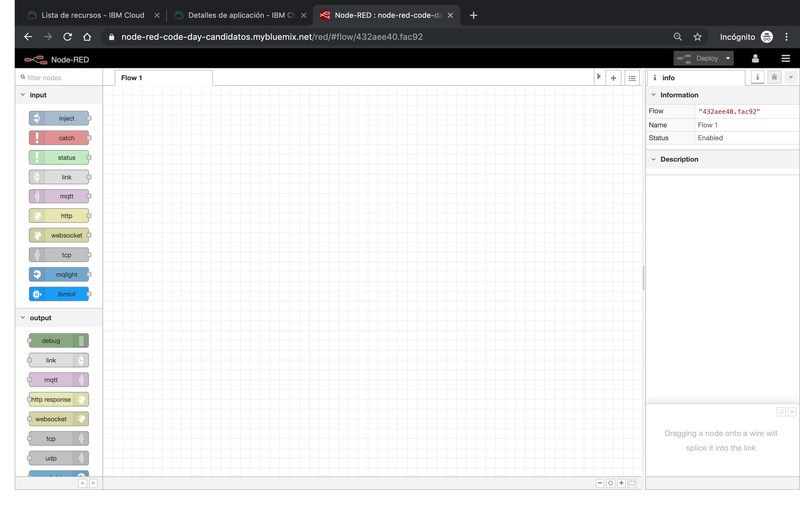

En el panel izquierdo se encuentran diferentes nodos para manejar entradas, salidas, funciones, redes sociales, almacenamiento, API de Watson y otras que sepueden utilizar en tus flujos. La sección central presenta espacio en blanco par adiseñar flujos. Finalmente, el panel de la derecha tiene una pestaña para desplegar información del nodo seleccionado y una pestaña para desplegar mensajes dedebug. Hay dos tipos de nodos, los que tienen una conexión y los que tienen dos conexiones.

Los que tienen una conexión son de entrada o salida y los que tienen dos conexiones son nodos intermedios o funciones.

[6.2 Clasificar texto usando Watson Assistant y Natural Language Understanding en Node-RED]()

  - **6.2.1** Desde el panel izquierdo arrastraremos el nodo `inject` hacia nuestro flujo.

    

  - **6.2.2** Luego, en el panel de la izquierda, buscaremos los nodos de la categoria `IBM Watson` y arrastraremos los nodos `assistant V2` y `Natural Language Understanding`.

    
    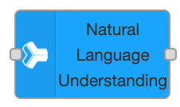

  - **6.2.3** Por ultimo, buscaremos en el panel de la izquierda dentro de la categoría `output` el nodo `debug` y lo arrastraremos dos nodos de estos hacia nuestro flujo.

    

  - **6.2.4** Conectar los nodos de nuestro flujo:
    * La salida del nodo `inject` la uniermos con la entrada del nodo `assistant V2` y con la entrada del nodo `Natural Language Understanding`.
    * La Salida del nodo `assistant V2` la uniremos con la entrada de uno de los nodos de `debug`
    * La Salida del nodo `Natural Language Understanding` la uniremos con la entrada del otro de los nodos de `debug`

      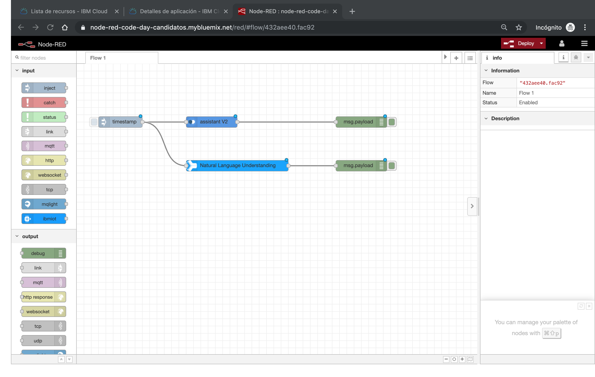

  - **6.2.5** Modificaremos el mensaje que queremos clasificar y que se lo enviaremos a los servicios de Watson. Damos doble click sobre nuestro nodo `inject`(probablemente diga timestamp) y se nos abrira el panel de edicion del nodo.

    En en campo `Payload` damos click sobre `timestamp` y se nos abrira una lista con opciones donde seleccionaremos `String` y escribiremos el mensaje que queremos seleccionar y luego presionamos `Done`

    Por ejemplo:

        Mucho miedo se percibe por acá. Se viene Lacalle Pou Presidente. Se acabó la joda. #NoMasFa
        Sos un grande y vas a ser Nuestro Presidente Vamo arriba Luis Lacalle Pou!!!
        Un miedo barbaro a q gane lacalle pou firme. Aparte mis presentimientos fallan poco jajaj
        Ustedes se imaginan a Lacalle Pou, Talvi, Manini, Mieres, Novick y algún otro, sentados en la misma mesa armando un plan para que no gane el FA? A mi me da un poquito de miedo.
        Lo único que pido es que no gane Lacalle Pou 😥🤞🏽

  - **6.2.6** Luego debemos agregar las credenciales a los nodos de `assistant V2`. **Solo** completamos los campos `ÀPI Key` y `Assistant ID` con las credenciales de nuestro servicio de Watson Assistant. Presionamos `Done`.

    La salida de este nodo, quedará guardada en `msg.payload` por lo tanto, el nodo debug que esta conectado a `assistant V2` no lo modificamos.

  - **6.2.7** Hacemos lo mismo para el servicio `Natural Language Understanding` completamos **solo** el campo `API Key` y marcamos las casillas `Document Sentiment` y `Entities`. Presionamos `Done`.

    La salida de este nodo, quedará guardada en `msg.features` por lo tanto tenemos que modificar el nodo debug que esta conectado a `Natural Language Understanding`.
    En el campo output, veremos que dice `msg.payload`, modificaremos `payload`y escribiremos `features`.

  - **6.2.8** Una vez que hayamos completado todos los pasos previos daremos presionaremos `Deploy` en la esquina superior derecha y si hiciste todo bien deberías ver un mensaje que diga `Succesfully deployed``

    

  - **6.2.9** Presionar la pestaña al lado del nodo `inject` para ejecutar nuestro flujo. En el panel de la derecha presionaremos el logo de `debug` (con forma de araña) para poder ver la salida de nuestro flujo.

    
